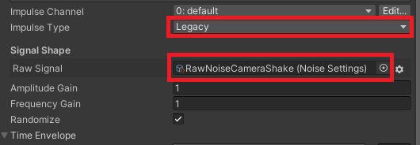

# Program: Camera Shake (Demo)
Program description: This program just using ask demo/learn demo, for only purpose learning and self teaching myself. Main feature: using Basic Shake, Cinemachine Impluse Listener Event <br />
Creator: NgocPHV <br />
Date Created: 26/06/2023 - 15:30 (AM GMT +7) <br />
Date Finished: 27/06/2023 - 11:21 (PM GMT +7)  <br />

## Index contents
* [General info](#general-info)
* [Technologies](#technologies)
* [Feature](#feature)
* [Explain](#explain)
* [Demo](#demo)

## General info
From some tutorial I watch: <br />
- When something explosion, the camera will shake

## Technologies
Project is created with:
* Unity Editor Version: 2021.3.26f1
* Unity Package: Cinemachine
* Unity Asset: Cartoon FX Remaster (Free version) - [link](https://assetstore.unity.com/packages/vfx/particles/cartoon-fx-remaster-free-109565)
 
## Feature
- When spacebar has been pressed, the explosion will active, add camera will shake

## Explain
#### Basic Shake:
- Just create random X and Y for every single frame in shake duration, and then, multiply it with Magnitude:
```
float X = Random.Range(-1f, 1f) * Magnitude;
float Y = Random.Range(-1f, 1f) * Magnitude;
```
- Replace curent local position of camera with new positon from X and Y, Z position will not be changed:
```
this.transform.localPosition = new Vector3(X, Y, Z);
```
- This shake will be placed in a IEnumerator that will be called in one any frame and run to the end of duration:
```
public IEnumerator ShakeCamera(float Duration, float Magnitude)
```
```
StartCoroutine(ShakeCamera(Duration, Magnitude));
```

#### Cinemachine Shake:
This shake need to set a lot:
- Create a Impluse Listener for Virtual Camera
- Create a Source that will holder the Impluse Source. In Source, set Impluse Type to Legacy, and create a new Raw Signal <br />

- Create Component for Position X, Y, Z by yourself. All components of this Position will be combine to one output diagram <br />

- Then, call it in your script with GenerateImpluse as Invoke in Event:
```
ImpulseSource.GenerateImpulse();
```

## Demo
(*This Gif has been captured by LICEcap, not my shader if you confuse)
- Basic Shake


- Cinemachine Shake

